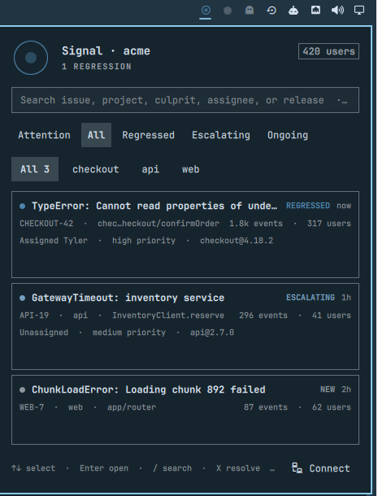
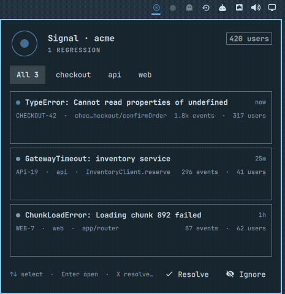

# Signal

**Your production app broke. Know before your users tell you.**

Signal is a quiet [Sentry](https://sentry.io/) incident inbox built for the Omarchy Quattro bar. When production is healthy, it stays out of the way. When an issue regresses or escalates, the bar wakes up and puts the useful evidence one click away.



<p align="center">
  
</p>

## What it does

- Shows up to 100 unresolved issues across every accessible project
- Distinguishes new, ongoing, escalating, and regressed lifecycle states
- Adds a count badge only for regressions and escalating issues, not ordinary backlog
- Searches issue IDs, titles, projects, culprits, assignees, and releases locally
- Filters by project and lifecycle without another API request
- Supports Sentry's Recommended, Last Seen, Events, Users, Trending, and First Seen sorts
- Summarizes event volume, affected users, assignment, priority, and release
- Keeps a separately scoped last-known-good response for every organization/environment
- Notifies once when an issue newly regresses or escalates, with a quiet first-run baseline
- Opens the full issue in Sentry
- Resolves or archives the selected issue after an explicit confirmation
- Works entirely from the keyboard: arrows, Enter, `/`, `X`, `I`, and `R`
- Includes a deterministic demo feed for screenshots and evaluation

Signal talks directly to Sentry with `curl`; it installs no daemon, runtime, or package. The normal refresh interval is five minutes, opening the panel triggers an immediate refresh, concurrent refreshes are coalesced, and requests have strict connection and total timeouts. Sentry rate-limit headers are retained in the model for diagnostics.

## Install

```bash
omarchy plugin add https://github.com/tsouth89/signal.git --enable
```

## Connect Sentry

Open Signal and choose **Connect Sentry**. The setup terminal asks for:

1. Your organization slug
2. Your Sentry API origin (`https://us.sentry.io` or `https://de.sentry.io` when the organization uses a regional data silo; otherwise `https://sentry.io`)
3. An authentication token

Recommended token scopes follow least privilege:

- `event:read`
- `event:write` for Resolve and Archive

Signal checks the organization and read permissions before changing anything. The token is written to Secret Service through `secret-tool`; it is never stored in the plugin directory, configuration, logs, QML state, or a child-process argument. API requests feed the authorization header to `curl` over standard input. The organization and base URL are stored in `~/.config/omarchy/signal/config.json` with user-only permissions.

Run **Connect Sentry** again at any time to verify or replace the connection. To disconnect completely, replace `YOUR_ORG_SLUG` below and then remove Signal's local configuration:

```bash
secret-tool clear service tsouth89.signal organization YOUR_ORG_SLUG
rm -r ~/.config/omarchy/signal ~/.local/state/omarchy/signal
```

## Keyboard controls

| Key | Action |
| --- | --- |
| `↑` / `↓` | Select an issue |
| `Enter` | Open the issue in Sentry |
| `/` | Search the current inbox |
| `1`–`5` | Select Attention, All, Regressed, Escalating, or Ongoing |
| `[` / `]` | Select the previous or next project |
| `X` | Resolve the selected issue |
| `I` | Archive the selected issue |
| `R` | Refresh |
| `Esc` | Close Signal |

Right-click the bar icon to refresh without opening the panel.

## Demo mode

Enable **Use demonstration data** in the bar-widget settings to display three realistic incidents without a Sentry account or network request. Actions are intentionally disabled in demo mode.

## Privacy and security

- No telemetry
- No privileged commands
- No install hooks
- No token in configuration files, logs, command arguments, or QML state
- Network requests go only to the configured HTTPS Sentry origin
- Organization slugs, tokens, issue IDs, sort values, limits, environments, and origins are validated before use
- Authentication, permission, missing-resource, rate-limit, and network failures have distinct user-facing messages
- API requests time out rather than accumulating in the shell

Community plugins execute unsandboxed inside `omarchy-shell`; inspect the source before enabling any plugin.

## Development

```bash
tests/run.sh
omarchy plugin validate .
```

The backend tests replace `curl` and Secret Service with local fakes. They verify normalization, cache fallback, setup state, demo data, shell syntax, the manifest, and that credentials never appear in `curl` arguments. They never contact Sentry or mutate an account.

The submission build has also completed a live organization-token test against Sentry's US API: ingest, read, production filtering, grouping, counts, Resolve, Archive, regression recognition, and final cleanup.

## Known limits

- Signal currently uses token authentication rather than browser OAuth.
- Sentry's organization-issues endpoint caps one response at 100 issues; Signal intentionally respects that cap rather than walking pages continuously in a desktop shell.
- A first successful refresh establishes the alert baseline and does not notify.
- Sentry self-hosted installations must use an HTTPS origin without a path prefix.

## License

MIT
