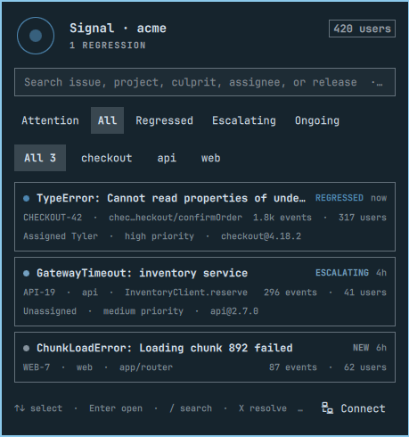

<p align="center">
  
</p>

<h1 align="center">Signal</h1>

<p align="center"><strong>Your production app broke. Know before your users tell you.</strong></p>

<p align="center">A quiet, native Sentry incident inbox for the Omarchy Quattro bar.</p>

<p align="center">
  <a href="https://github.com/tsouth89/signal/releases"></a>
  <a href="https://github.com/tsouth89/signal/blob/main/LICENSE"></a>
  
  
  
</p>

<p align="center">
  
</p>

Signal keeps production invisible when everything is healthy. When an issue regresses or escalates, its bar icon wakes up, shows a focused attention count, and puts the useful evidence one click away—without asking you to live in another dashboard.

> **Quiet by default. Useful under pressure.** The first successful refresh establishes a silent baseline. After that, Signal only alerts when something newly needs attention.

## The incident inbox

<p align="center">
  
</p>

- See up to 100 unresolved issues across every accessible project
- Separate **new**, **ongoing**, **escalating**, and **regressed** lifecycle states
- Search issue IDs, titles, projects, culprits, assignees, and releases instantly
- Filter by project or lifecycle without spending another API request
- Sort using Sentry's Recommended, Last Seen, Events, Users, Trending, or First Seen order
- See event volume, affected users, assignment, priority, culprit, and release at a glance
- Open the full Sentry issue, or Resolve and Archive it after an explicit confirmation
- Work entirely from the keyboard

## Install

```bash
omarchy plugin add https://github.com/tsouth89/signal.git --enable
```

Signal installs no daemon, JavaScript runtime, SDK, or background service. It uses the tools already included with Omarchy and runs inside `omarchy-shell` as a native Quickshell/QML bar widget.

## Connect Sentry

Open Signal from the bar and choose **Connect Sentry**. Enter your organization slug, API origin, and a Sentry authentication token.

Use the narrowest token scopes that support the actions you want:

| Capability | Token scope |
| --- | --- |
| Read and open issues | `event:read` |
| Resolve and Archive | `event:write` |

Signal verifies the organization and read permission before changing anything. The token is stored in Secret Service through `secret-tool`; it is never written to plugin files, configuration, logs, QML state, cache files, or process arguments.

For Sentry's regional data silos, use `https://us.sentry.io` or `https://de.sentry.io`. Standard SaaS organizations use `https://sentry.io`. Self-hosted Sentry is supported through a path-free HTTPS origin.

### Replace or disconnect

Choose **Connect** again to verify or replace the active connection. To disconnect completely, replace `YOUR_ORG_SLUG` and remove Signal's local cache:

```bash
secret-tool clear service tsouth89.signal organization YOUR_ORG_SLUG
rm -r ~/.config/omarchy/signal ~/.local/state/omarchy/signal
```

## Keyboard controls

| Key | Action |
| --- | --- |
| `↑` / `↓` | Select an issue and keep it in view |
| `Enter` | Open the selected issue in Sentry |
| `/` | Search the current inbox |
| `1`–`5` | Select Attention, All, Regressed, Escalating, or Ongoing |
| `[` / `]` | Select the previous or next project |
| `X` | Resolve the selected issue |
| `I` | Archive the selected issue |
| `R` | Refresh |
| `Esc` | Close Signal |

Right-click or middle-click the bar icon to refresh without opening the panel.

## Settings

All settings are available from Omarchy's bar-widget settings—no configuration file editing required.

| Setting | Default | Range / options |
| --- | --- | --- |
| Refresh interval | 5 minutes | 1–60 minutes |
| Environment | `production` | Any Sentry environment; blank includes all |
| Sort order | Recommended | Recommended, Last Seen, Events, Users, Trending, First Seen |
| Maximum issues | 50 | 10–100 |
| Desktop alerts | Regressions and escalating | Regressions and escalating, regressions only, off |
| Demo mode | Off | Realistic local feed with no Sentry request |

## Designed to stay quiet

- **No polling daemon:** one bounded request on the configured interval
- **Immediate when useful:** opening the panel refreshes unless a request is already running
- **No request pileups:** concurrent refreshes are coalesced and actions are guarded while busy
- **No noisy first run:** the initial result becomes the notification baseline
- **No blank offline state:** the last-known-good response is shown for network, rate-limit, and Sentry 5xx failures
- **No cross-account bleed:** cache and alert state are isolated by API origin, organization, and environment
- **No title leakage:** desktop alerts say that an issue needs attention without exposing incident content
- **Bounded work:** strict connection/total timeouts and Sentry's 100-issue response cap

## Security model

- HTTPS-only API origins and issue links
- Strict validation for origins, organization slugs, issue IDs, environments, limits, and sort values
- Secret Service credential storage with transactional connection changes
- Authorization passed to `curl` over standard input, never command arguments
- User curl configuration disabled for authenticated requests
- Configuration and cache files restricted to the current user
- No telemetry, privileged commands, install hooks, or third-party runtime dependencies

Community plugins execute unsandboxed inside `omarchy-shell`; inspect the small source tree before enabling any plugin.

Suspected vulnerabilities should be reported privately through the repository's [security policy](SECURITY.md), never through a public issue.

## Demo mode

Enable **Use demonstration data** in the widget settings to display three realistic incidents without a Sentry account or network request. Destructive actions are intentionally unavailable in demo mode. This is also the fastest way to evaluate Signal's interaction design.

## Development and verification

```bash
tests/run.sh
omarchy plugin validate .
```

The test suite replaces `curl` and Secret Service with local fakes. It covers response normalization, cache isolation and fallback, rate limiting, notification baselining and deduplication, setup rollback, malformed inputs, token transport, shell syntax, and manifest validation. Tests never contact Sentry or mutate an account.

Before the 1.0 release, Signal was also exercised against a real Sentry organization: event ingest, production filtering, grouping, counts, regression detection, Resolve, Archive, and final cleanup. The plugin additionally passed repeated hot reloads and a clean remove/install/enable cycle.

## Known limits

- Authentication uses a Sentry token rather than browser OAuth.
- Sentry's organization-issues endpoint caps a response at 100 issues; Signal respects that limit instead of continuously walking pages inside the desktop shell.
- The first successful refresh establishes the alert baseline and does not notify.
- Self-hosted Sentry origins must use HTTPS and cannot include a path prefix.

## License

Signal is available under the [MIT License](LICENSE).
